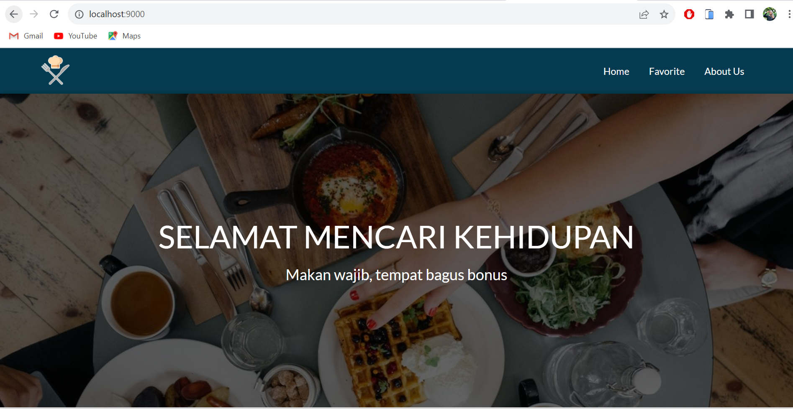
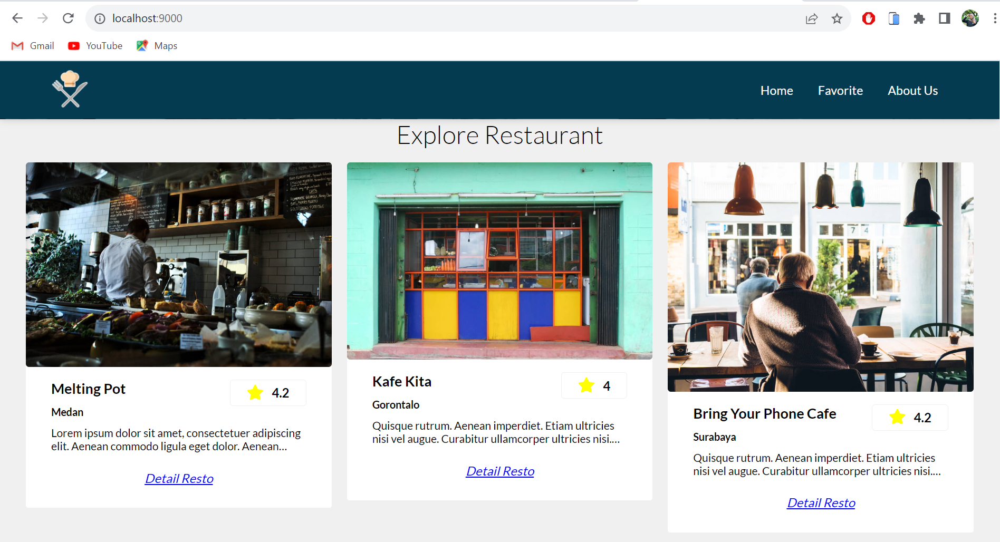
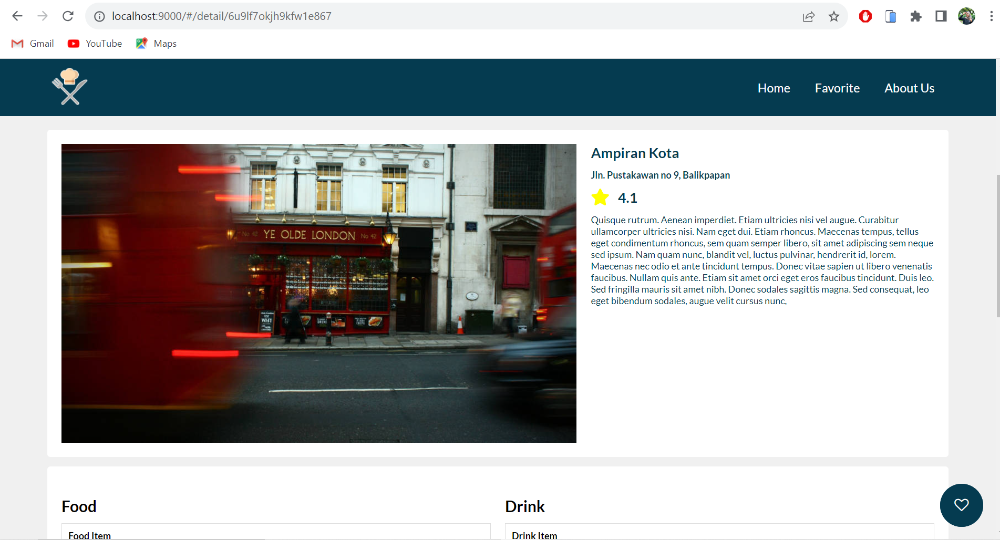
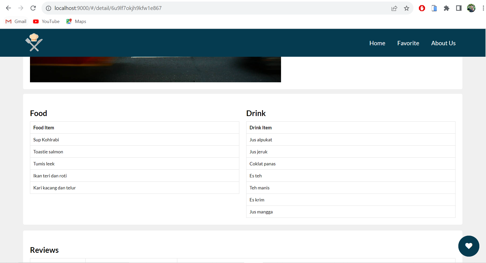
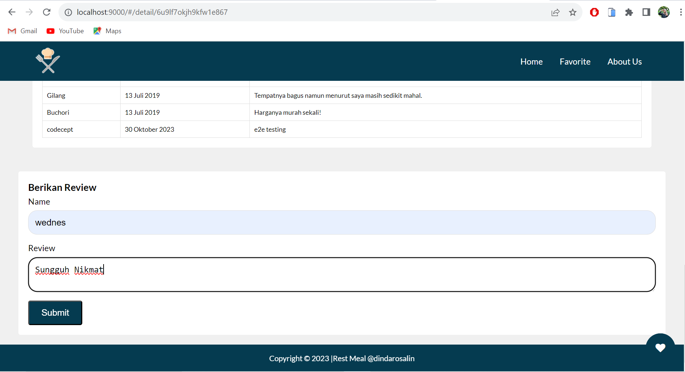
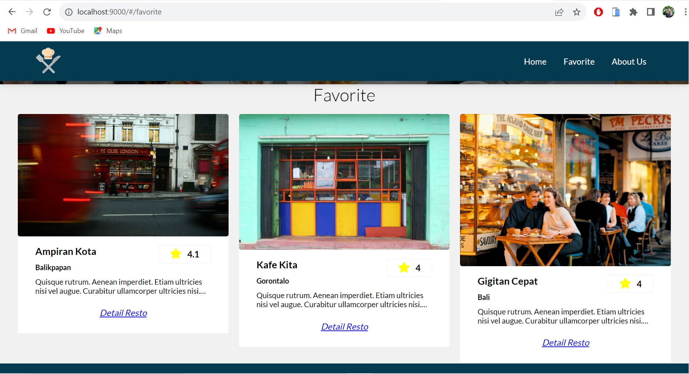
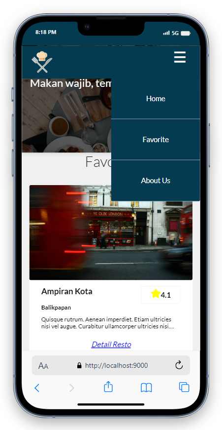
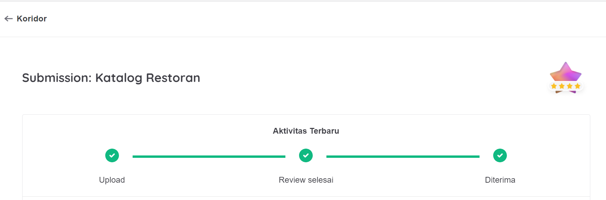
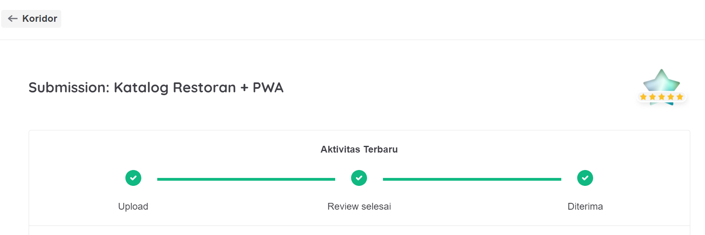

# rest-meal
Aplikasi yang menampilkan daftar restaurants dari data.json
# Front-End Tools
1. Javascript menggunakan Webpack
2. Html & CSS
# Implementations
1. Responsibility
2. Accessibility
3. Native Capability
4. Code Quality using ESlint
5. PWA Implementation
6. Integration Test
7. End to end Test
8. Image Optimization
9. Bundle Optimization
# Features
1. Landing Page with Restaurants List aka /Home
2. Detail Page to see detail's restaurant
3. Like Button to Liked and add a restaurant to Favorite Restaurants List
4. Review Form to Add a Review
5. Favorite Page to see All Favorite Restaurants
# UI

# Achievement

# Sertification
(https://www.dicoding.com/certificates/2VX36ENEVXYQ)